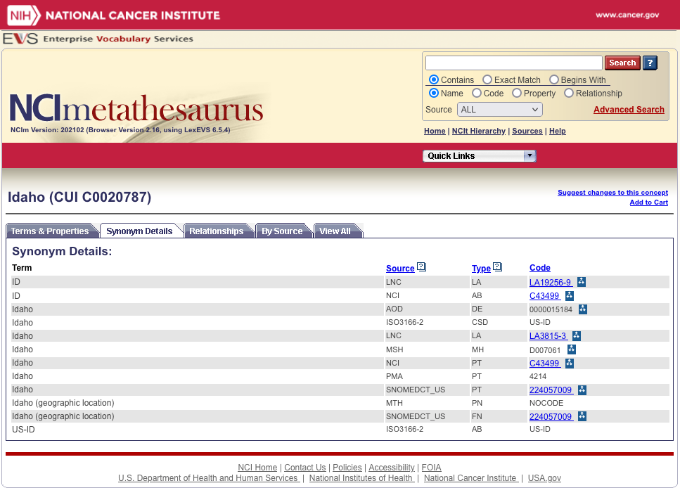
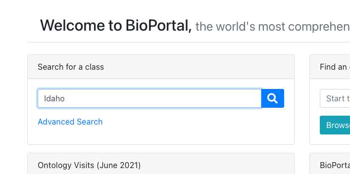

## Distinguished individuals
Our primary task when it comes to addressing distinguished individuals
is to ensure that they are indeed modeled as individuals.  Taking the
state of Idaho as an an example,

* SNOMED-CT models Idaho as a [class](http://snomed.info/id/224057009),
  with a basic definition
  ```
  SubClassOf(
	:224057009 |Idaho (geographic location)|
	:224037005 |Region of United States of America (geographic location)|
  )
  111
  
* NCI Thesaurus also models Idaho as a [class](https://ncithesaurus.nci.nih.gov/ncitbrowser/ConceptReport.jsp?dictionary=NCI_Thesaurus&ns=ncit&code=C43499).
  The definition is considerably richer:
 (Fill in NCI metathesaurus and other definitions
 
 

* OntoBee -- the gazetteer gets it right.

Once we have the distinguished individuals modeled correctly, it is a
relatively straightforward matter to do ontology based transformations.

For our, we start with an information model that records
a person's state of birth.  Using an ontology (a combination of GAZ + our
own assertions for the moment), we can infer that the person was born in
the western section of the United states and that they were born in the
US.  We then use these new assertions to create a second information model
derived from the first w/ two fields -- born in the US (boolean) and
something about the section the person was born in.

Notes: Both OntoBee
1. Translate an information model into its corresponding model of meaning:
   * Here we take a very simple information model, which we represent in LinkML
     that has a person name and their state of residence.  We map this into
     a small ontology (we should take a look at the GAZ resource from Ontobee)
   * 


BioPortal:  Note that BioPortal is so strongly class biased that there
isn't even a PLACE to enter an individual:



## Proxy individuals
There is another whole class of individuals, which we will call "proxy
individuals".  "Proxy individuals" are (roughly?) equivalent to the
notion of "definite description" as represented by the mu operator in Z,
(see page 52 in Woodcock and Davies).  The rules for the mu operator are,
_if_ it can be shown that there exists a unique `x` in a set `a` such that
some predicate `p` holds, we can introduce a new individual, `t` that is
equal to the mu-expression `(mu x : a | p)`.

## SNOMED Examples

* [Retinitis of left eye](http://snomed.info/id/15685841000119104) - this allows the unique individual assertion when
coupled with the owner of a particular left eye.
* [Structure of triangular bone of left wrist](http://snomed.info/id/764825000) - an assertion of unique individuals
(Assuming that there is exactly ONE triangular bone in the left wrist)
* [Computed tomography of tooth](http://snomed.info/id/709699007) -- this is an interesting example. If we assert that

## General questions
1. Ignoring modifiers (as they defined by FHIR), can we assume that any
assertion in an information record implies:
   1. Existence?  The CT scan of John's tooth shows that...  According to Dr. Smith,
   as of July 2, 2021, Joe had appendicitis...
   2. _Unique existence_?  On the surface, this seems not to be the case, yet the
   language clearly shows that we are talking about a _specific_ CT scan _and_ a specific
   tooth, even though neither have been named.

2. We should be able to formulate and prove the following bit of logic:

Ontology:
    Every instance of appendicitis is an instance of inflammation that occurs
    in one or more of the components of a particular appendix.  
    (This is the


