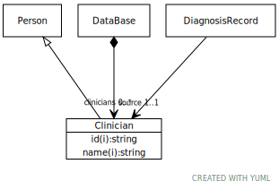

# Class: Clinician

A person providing care

URI: [dbdx:Clinician](https://ontologies-r.us/diabetes/Clinician)

## Parents

 *  is_a: [Person](Person.md) - A placeholder for a person identifier

## Referenced by class

 *  **None** *[➞clinicians](dataBase__clinicians.md)*  0..\*  **[Clinician](Clinician.md)**
 *  **None** *[➞source](diagnosisRecord__source.md)*  1..1  **[Clinician](Clinician.md)**

## Attributes

### Inherited from Person:

 * [➞id](person__id.md)  1..1
     * Description: An identifier assigned to the patient by this particular model.
     * Range: [String](types/String.md)
 * [➞name](person__name.md)  1..1
     * Description: A person's name
     * Range: [String](types/String.md)
