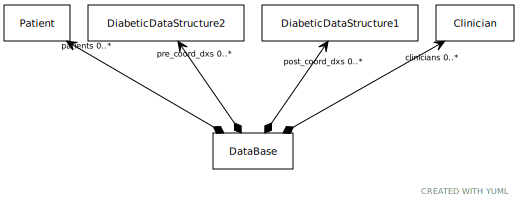

# Class: DataBase

A collection of Patients / Clinicians and both forms of DiabeticDataStructures

URI: [dbdx:DataBase](https://ontologies-r.us/diabetes/DataBase)

## Attributes

### Own

 * [➞patients](dataBase__patients.md)  0..\*
     * Description: Reference Patients
     * Range: [Patient](Patient.md)
 * [➞clinicians](dataBase__clinicians.md)  0..\*
     * Description: Reference Clinicians
     * Range: [Clinician](Clinician.md)
 * [➞post_coord_dxs](dataBase__post_coord_dxs.md)  0..\*
     * Description: Post coordinated diagnoses
     * Range: [DiabeticDataStructure1](DiabeticDataStructure1.md)
 * [➞pre_coord_dxs](dataBase__pre_coord_dxs.md)  0..\*
     * Description: Pre coordinated diagnoses
     * Range: [DiabeticDataStructure2](DiabeticDataStructure2.md)
