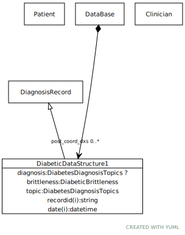

# Class: DiabeticDataStructure1

A model of a post-coordinated diabetes data structure

URI: [dbdx:DiabeticDataStructure1](https://ontologies-r.us/diabetes/DiabeticDataStructure1)

## Parents

 *  is_a: [DiagnosisRecord](DiagnosisRecord.md) - A simplified diagnosis record

## Referenced by class

 *  **None** *[➞post_coord_dxs](dataBase__post_coord_dxs.md)*  0..\*  **[DiabeticDataStructure1](DiabeticDataStructure1.md)**

## Attributes

### Own

 * [➞diagnosis](diabeticDataStructure1__diagnosis.md)  0..1
     * Description: The code for diabetes or any kind of diabetes
     * Range: [DiabetesDiagnosisTopics](DiabetesDiagnosisTopics.md)
 * [➞brittleness](diabeticDataStructure1__brittleness.md)  1..1
     * Description: How well managed the diabetes is
     * Range: [DiabeticBrittleness](DiabeticBrittleness.md)
 * [DiabeticDataStructure1➞topic](DiabeticDataStructure1_topic.md)  1..1
     * Description: Exact code for diabetes mellitus
     * Range: [DiabetesDiagnosisTopics](DiabetesDiagnosisTopics.md)

### Inherited from DiagnosisRecord:

 * [➞recordid](diagnosisRecord__recordid.md)  1..1
     * Description: The id of a formal diagnostic event
     * Range: [String](types/String.md)
 * [➞patient](diagnosisRecord__patient.md)  1..1
     * Description: The patient to whom the diagnosis applies
     * Range: [Patient](Patient.md)
 * [➞source](diagnosisRecord__source.md)  1..1
     * Description: The clinician who asserted the diagnosis
     * Range: [Clinician](Clinician.md)
 * [➞date](diagnosisRecord__date.md)  1..1
     * Description: The date and time that the assertion was made
     * Range: [Datetime](types/Datetime.md)
