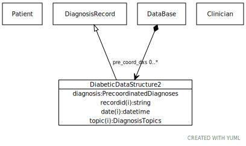

# Class: DiabeticDataStructure2

A model of a pre-coordinated diabetes data structure

URI: [dbdx:DiabeticDataStructure2](https://ontologies-r.us/diabetes/DiabeticDataStructure2)

## Parents

 *  is_a: [DiagnosisRecord](DiagnosisRecord.md) - A simplified diagnosis record

## Referenced by class

 *  **None** *[➞pre_coord_dxs](dataBase__pre_coord_dxs.md)*  0..\*  **[DiabeticDataStructure2](DiabeticDataStructure2.md)**

## Attributes

### Own

 * [➞diagnosis](diabeticDataStructure2__diagnosis.md)  1..1
     * Description: The code for diabetes or any kind of diabetes
     * Range: [PrecoordinatedDiagnoses](PrecoordinatedDiagnoses.md)

### Inherited from DiagnosisRecord:

 * [➞recordid](diagnosisRecord__recordid.md)  1..1
     * Description: The id of a formal diagnostic event
     * Range: [String](types/String.md)
 * [➞patient](diagnosisRecord__patient.md)  1..1
     * Description: The patient to whom the diagnosis applies
     * Range: [Patient](Patient.md)
 * [➞source](diagnosisRecord__source.md)  1..1
     * Description: The clinician who asserted the diagnosis
     * Range: [Clinician](Clinician.md)
 * [➞date](diagnosisRecord__date.md)  1..1
     * Description: The date and time that the assertion was made
     * Range: [Datetime](types/Datetime.md)
 * [➞topic](diagnosisRecord__topic.md)  1..1
     * Description: The topic of the diagnostic record
     * Range: [DiagnosisTopics](DiagnosisTopics.md)
