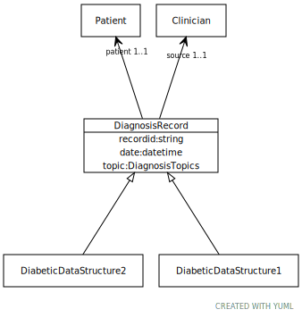

# Class: DiagnosisRecord

A simplified diagnosis record

URI: [dbdx:DiagnosisRecord](https://ontologies-r.us/diabetes/DiagnosisRecord)

## Children

 * [DiabeticDataStructure1](DiabeticDataStructure1.md) - A model of a post-coordinated diabetes data structure
 * [DiabeticDataStructure2](DiabeticDataStructure2.md) - A model of a pre-coordinated diabetes data structure

## Referenced by class

## Attributes

### Own

 * [➞recordid](diagnosisRecord__recordid.md)  1..1
     * Description: The id of a formal diagnostic event
     * Range: [String](types/String.md)
 * [➞patient](diagnosisRecord__patient.md)  1..1
     * Description: The patient to whom the diagnosis applies
     * Range: [Patient](Patient.md)
 * [➞source](diagnosisRecord__source.md)  1..1
     * Description: The clinician who asserted the diagnosis
     * Range: [Clinician](Clinician.md)
 * [➞date](diagnosisRecord__date.md)  1..1
     * Description: The date and time that the assertion was made
     * Range: [Datetime](types/Datetime.md)
 * [➞topic](diagnosisRecord__topic.md)  1..1
     * Description: The topic of the diagnostic record
     * Range: [DiagnosisTopics](DiagnosisTopics.md)
