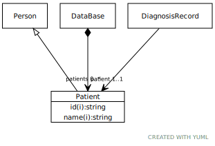

# Class: Patient

A person undergoing diagnosis or care

URI: [dbdx:Patient](https://ontologies-r.us/diabetes/Patient)

## Parents

 *  is_a: [Person](Person.md) - A placeholder for a person identifier

## Referenced by class

 *  **None** *[➞patients](dataBase__patients.md)*  0..\*  **[Patient](Patient.md)**
 *  **None** *[➞patient](diagnosisRecord__patient.md)*  1..1  **[Patient](Patient.md)**

## Attributes

### Inherited from Person:

 * [➞id](person__id.md)  1..1
     * Description: An identifier assigned to the patient by this particular model.
     * Range: [String](types/String.md)
 * [➞name](person__name.md)  1..1
     * Description: A person's name
     * Range: [String](types/String.md)
