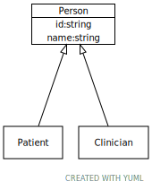

# Class: Person

A placeholder for a person identifier

URI: [dbdx:Person](https://ontologies-r.us/diabetes/Person)

## Children

 * [Clinician](Clinician.md) - A person providing care
 * [Patient](Patient.md) - A person undergoing diagnosis or care

## Referenced by class

## Attributes

### Own

 * [➞id](person__id.md)  1..1
     * Description: An identifier assigned to the patient by this particular model.
     * Range: [String](types/String.md)
 * [➞name](person__name.md)  1..1
     * Description: A person's name
     * Range: [String](types/String.md)
